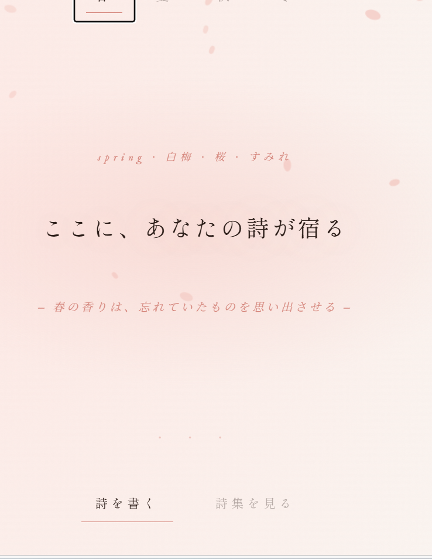
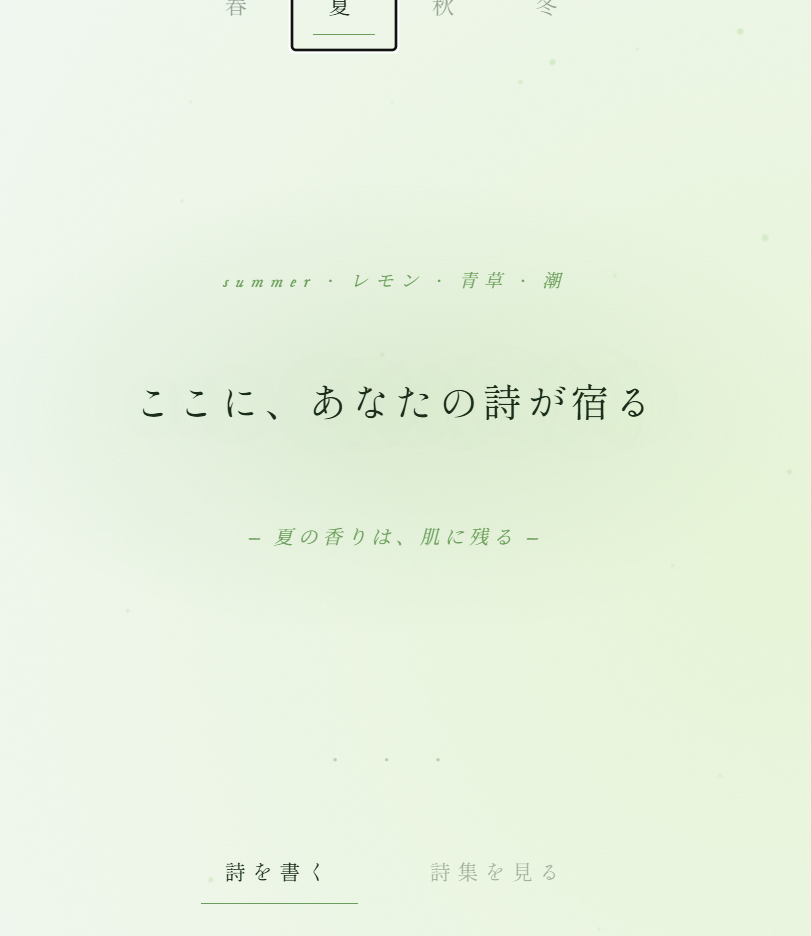
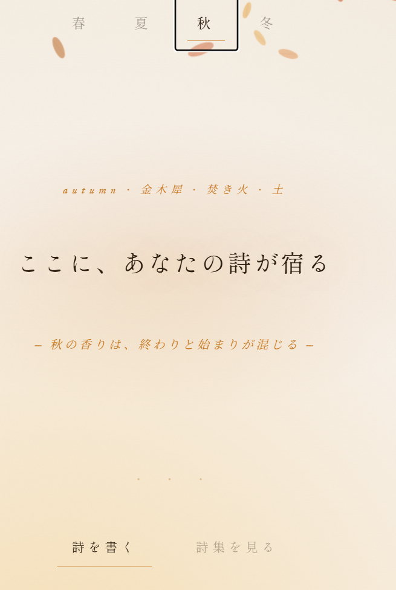
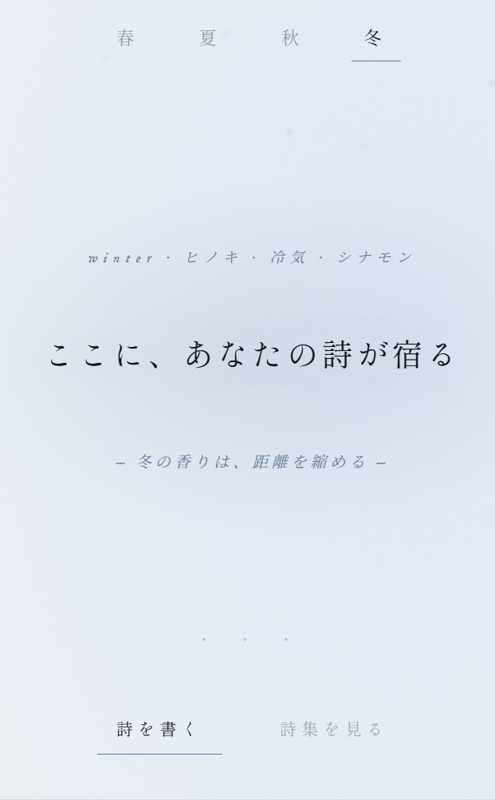

# 薫 — 詩と本音のアプリ集

季節の香りと共に詩を書く、そして誰にも見せない本音を置く場所。


| 春 | 夏 |
|---|---|
| 



 | 



 |

| 秋 | 冬 |
|---|---|
| 



 | 




## 収録アプリ

### 🌸 薫 — 詩集 (`kaoru_poetry.html`)
季節ごとに変化する背景と落下エフェクトを持つ詩集アプリ。
体験↓
https://kaoru-poetry.vercel.app/kaoru_poetry.html
**特徴**
- 春・夏・秋・冬で異なるパーティクル演出
  - 春：桜の花びらがふわふわ横に揺れながら舞い落ちる
  - 夏：光の雫が細く速く真っ直ぐ降る
  - 秋：大きな葉がゆっくり左右にゆれながら落ちる（葉脈付き）
  - 冬：雪の結晶が静かにまっすぐ降る
- 詩をタイプライター演出で舞台に映し出す
- 詩集として保存・閲覧（localStorage）
- カスタムカーソル演出
- スマホ（Pixel等）対応

---

### 🌙 今夜の本音 (`lonely_letter.html`)
誰にも見せない、自分だけの深夜日記アプリ。
体験↓
https://kaoru-poetry.vercel.app/lonely_letter.html
**特徴**
- 8つの感情から今夜の気持ちを選ぶ
- 感情ごとに異なる肯定メッセージが現れる
- 雨と月の光の背景演出
- 手紙として保存・閲覧・削除（localStorage）

---

## 使い方

ブラウザでHTMLファイルを直接開くだけで動作します。
サーバー不要、インストール不要。

```

cd リポジトリ名
# kaoru_poetry.html または lonely_letter.html をブラウザで開く
```

---

 技術仕様

- 純粋なHTML / CSS / JavaScript（フレームワーク不使用）
- データ保存：localStorage（ブラウザ内のみ、外部送信なし）
- フォント：Google Fonts（Shippori Mincho, Noto Serif JP, IM Fell English, Cormorant Garamond）
- 外部依存なし

---

## ライセンス

MIT License — 自由に使用・改変・配布できます。

---

*思考と行動が明るく軽くなるアプリを目指して。*
